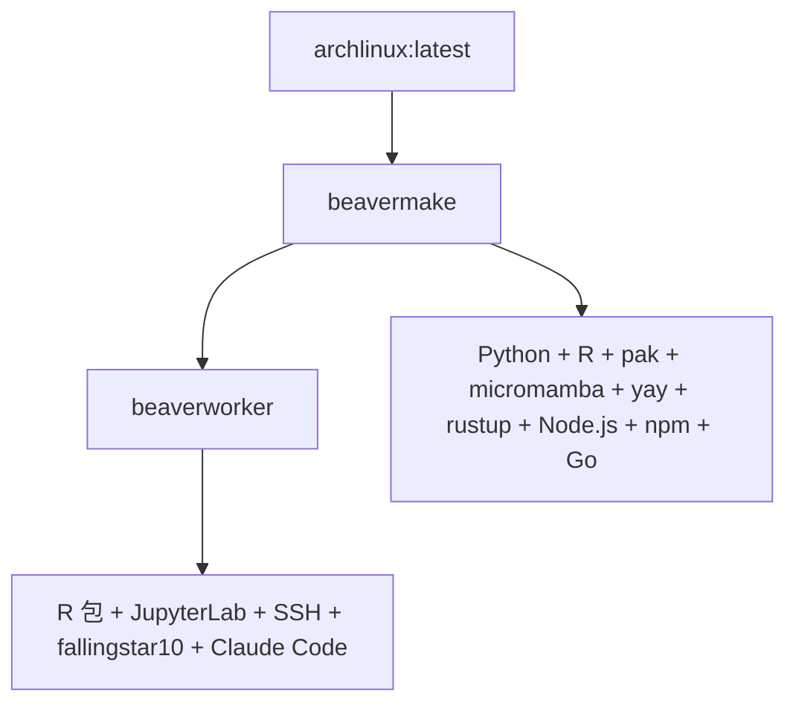

# 🦫 BeaverdownContainers - Beaverdown2生物信息学容器套件

[](https://github.com/rainoffallingstar/BeaverdownContainers/actions/workflows/beavermake.yml) [](https://github.com/rainoffallingstar/BeaverdownContainers/actions/workflows/beaverworker.yml)

---

## 📦 项目概述

BeaverdownContainers 是 **Beaverdown2 生物信息学工作流系统**的高效 Docker 容器套件 `<small>`(Efficient Docker container suite for the Beaverdown2 bioinformatics workflow system)`</small>`。这些容器专为性能和易用性设计，简化了生物信息学和数据分析任务。

✨ **核心特色**:

- 🐧 **基于 Arch Linux** - 轻量、灵活的 Linux 发行版
- 🧰 **yay AUR 助手** - 强大的 Arch 用户仓库包管理
- 🐍 **Python 3** - 完整的 Python 开发环境
- 📊 **R 语言环境** - 完整的统计分析生态系统（40+ 包）
- 📓 **JupyterLab** - 交互式计算环境（集成 Ark 增强）
- 🔧 **Ark + Air** - Posit Dev 开发工具链
- 💡 **R LSP 支持** - languageserver + lintr 代码质量工具
- 🦀 **Rust** - 高性能系统编程语言
- 🟢 **Node.js** - JavaScript 运行时
- 🔵 **Go** - 现代化编程语言
- 🤖 **Claude Code CLI** - 已全局安装

容器采用层次化设计，从基础镜像逐步构建，确保每一层都有明确的功能分工和依赖管理。

---

## 🏗️ 容器架构

### 📊 架构图



### 🎯 层次化容器结构

#### 1. **🛠️ beavermake** - 基础容器层

- **基础镜像**: `archlinux:latest`
- **编程语言**: Python 3, R, Rust, Node.js, Go
- **包管理器**:
  - **pip** (Python)
  - **pak** (R)
  - **micromamba** (跨语言包管理)
  - **yay** (Arch AUR)
  - **cargo** (Rust)
  - **npm** (Node.js)
  - **go mod** (Go)
- **特点**: 并行编译配置，最小权限用户 `builduser`

#### 2. **🧬 beaverworker** - 统一工作环境

- **继承自**: `fallingstar10/beavermake:latest`
- **R 语言环境**:
  - 40+ R 包（Shiny, 统计, 生信, 富集, 高级, ML）
  - Bioconductor 核心包
  - GitHub 专用包
- **集成功能**:
  - 📓 **JupyterLab** - 已安装，需手动启动（端口 8889）
    - 集成 **Ark** (Posit Dev) - 增强 JupyterLab 功能
  - 🔧 **Air** (Posit Dev) - R 包管理和发布工具
  - 💡 **R 语言服务器** - languageserver + lintr 支持
  - 🔐 **SSH 访问** - 自动启动（端口 2222）
  - 👤 **fallingstar10 用户** - 默认登录账户（密码：fallingstar10）
  - 🤖 **Claude Code CLI** - 已全局安装
  - 👥 **交互式用户管理** - `add-user` 命令创建新用户
- **备用端口**: 8080, 8787（可用于 Shiny 等其他服务）

---

## 🚀 快速开始

### 使用 Docker CLI

#### 1️⃣ 拉取预构建镜像

```bash
docker pull fallingstar10/beavermake:latest
docker pull fallingstar10/beaverworker:latest
```

#### 2️⃣ 运行容器

```bash
# 🛠️ beavermake - 基础开发环境
docker run -it --name beavermake fallingstar10/beavermake:latest

# 🧬 beaverworker - 完整工作环境（推荐）
docker run -p 2222:2222 -p 8889:8889 -p 8080:8080 -p 8787:8787 \
  --name beaverworker fallingstar10/beaverworker:latest
```

#### 3️⃣ 访问服务

**SSH 访问**（自动启动）:
```bash
ssh fallingstar10@localhost -p 2222
# 密码: fallingstar10
```

**启动 JupyterLab**（手动启动）:
```bash
# 方法 1: SSH 登录后启动
docker exec -it beaverworker /bin/bash
su - fallingstar10 -c 'jupyter-lab --no-browser --allow-root --ip=* --port=8889 &'

# 方法 2: 直接启动
docker exec beaverworker su - fallingstar10 -c "jupyter-lab --no-browser --allow-root --ip=* --port=8889" &
```

然后访问: **http://localhost:8889**

**创建新用户**:
```bash
# 进入容器
docker exec -it beaverworker /bin/bash

# 运行交互式用户管理脚本
sudo add-user
```

脚本将引导您完成用户创建过程。

### 使用 R/dockerR 包

```r
# 拉取镜像
source("pull_image.R")

# 从源码构建
source("build_image.R")
```

---

## 🔧 详细构建指南

### 🖥️ 本地构建

```bash
# 构建所有容器镜像
docker build -t fallingstar10/beavermake:latest ./beavermake
docker build -t fallingstar10/beaverworker:latest ./beaverworker
```

### ⚡ CI/CD 自动构建

项目使用 **GitHub Actions** 实现持续集成和自动部署：

- **🕐 定时构建**: 每周五自动构建
  - `beavermake`: 06:00 UTC
  - `beaverworker`: 08:00 UTC
- **🔔 触发条件**:
  - 📅 定时调度（每周）
  - 👆 手动触发 (`workflow_dispatch`)
  - 📝 对应目录的 `push` 事件
- **🚀 操作流程**: 自动构建并推送到 Docker Hub (`fallingstar10/` 命名空间)

---

## 📋 容器详细说明

### 🛠️ beavermake 容器

**基础镜像**: `archlinux:latest`

**🧰 核心工具**:

- **Python 3**: `python`, `pip`
- **R**: `r`, `pak` 包管理器
- **micromamba**: 轻量级 Conda 替代品
- **yay**: AUR 包管理器
- **Rust**: `rustup`, `rustc`, `cargo`
- **Node.js**: `node`, `npm`
- **Go**: `go`

**⚙️ 配置优化**:

- 并行编译配置
- 最小权限用户 `builduser`
- 镜像优化：清理缓存减少镜像大小

### 🧬 beaverworker 容器

**继承自**: `fallingstar10/beavermake:latest`

**🎯 主要功能**:

#### 1. 📊 R 语言环境

- **R 基础系统**: 完整的 R 语言运行时
- **包管理器**: 使用 `pak` 进行高效的 R 包管理
- **R 包组**:
  - **组1**: Shiny 生态（DT, shinyWidgets, bslib）
  - **组2**: 统计和可视化（plotly, pROC, tidyverse）
  - **组6**: 机器学习（mlr3verse）
  - **组7**: 开发工具（languageserver, lintr）

#### 2. 📓 JupyterLab + Posit Dev 工具

- **JupyterLab**:
  - **状态**: 已安装，需要手动启动
  - **启动命令**: `su - fallingstar10 -c 'jupyter-lab --no-browser --allow-root --ip=* --port=8889 &'`
  - **访问端口**: 8889
  - **语言支持**: Python, R, Bash
  - **扩展生态**: 可安装丰富的 JupyterLab 扩展

- **Ark (Posit Dev)**:
  - **版本**: 0.1.222
  - **功能**: 增强 JupyterLab 的 R 开发体验
  - **安装位置**: `/usr/bin/ark`
  - **自动集成**: 构建时执行 `ark --install`

- **Air (Posit Dev)**:
  - **功能**: R 包管理和发布工具
  - **安装方式**: 官方安装脚本
  - **用途**: 简化 R 包的创建、测试和发布流程

#### 3. 🔐 SSH 访问

- **状态**: 自动启动
- **端口**: 2222
- **默认用户**: fallingstar10（密码：fallingstar10）
- **配置**: 支持 SSH 密钥认证

#### 4. 👥 用户管理

- **工具**: `add-user` 交互式脚本
- **位置**: `/usr/local/bin/add-user`
- **功能**: 创建新用户，配置 sudo、SSH、环境
- **使用**: `sudo add-user`

#### 5. 🤖 Claude Code CLI

- **全局安装**: 可直接使用 `claude-code` 命令
- **用途**: AI 辅助编程

#### 6. 💡 R 语言服务器和代码质量工具

- **languageserver**:
  - **功能**: 为 R 提供 Language Server Protocol (LSP) 支持
  - **用途**: 代码补全、语法高亮、错误检查、定义跳转
  - **编辑器支持**: VS Code, Vim/Neovim, Emacs 等

- **lintr**:
  - **功能**: R 代码静态分析工具
  - **用途**: 代码风格检查、最佳实践建议、潜在问题检测
  - **集成**: 可与编辑器、CI/CD 流程集成

#### 7. 🌐 备用端口

- **8080**: 可用于 Shiny 等 R Web 应用
- **8787**: 预留给其他服务

---

## 🧪 使用示例

### 多语言开发

#### Python 开发

```bash
# 进入容器
docker exec -it beaverworker /bin/bash

# 使用 micromamba 安装包
micromamba install pandas numpy scipy -y

# Python 交互式
python
```

#### R 开发

```bash
# 使用 pak 安装 R 包
R -e "pak::pkg_install('dplyr', 'ggplot2')"

# R 交互式
R

# 使用 languageserver（LSP 支持）
# 在 VS Code 中安装 R 插件后，自动启用代码补全、跳转等功能

# 使用 lintr 进行代码检查
R -e "lintr::lint_dir('.')"

# 使用 Air 管理 R 包
air --help
```

#### Rust 开发

```bash
# 首次使用需要初始化 Rust 环境
source ~/.cargo/env

# 创建新项目
cargo new myproject
cd myproject
cargo run

# 安装常用工具
cargo install ripgrep  # rg - 超快的 grep
cargo install fd-find  # fd - 超快的 find
cargo install bat      # bat - 带高亮的 cat
```

#### Node.js 开发

```bash
# 初始化项目
npm init -y

# 安装依赖
npm install express

# 安装全局工具
npm install -g typescript prettier eslint yarn

# 使用 Claude Code
claude-code
```

#### Go 开发

```bash
# 检查版本
go version

# 创建项目
mkdir myproject && cd myproject
go mod init myproject

# 运行程序
go run main.go
```

---

## ⚙️ 系统要求

### 💻 最低硬件要求

- **内存**: 至少 4GB RAM（推荐 8GB+）
- **存储**: 至少 10GB 可用磁盘空间
- **CPU**: 支持虚拟化的多核处理器（推荐 4 核以上）

### 📦 软件要求

- **Docker**: 版本 20.10 或更高
- **操作系统**: 支持 Docker 的任何系统
  - 🐧 Linux: 原生支持
  - 🪟 Windows: 推荐使用 WSL2
  - 🍎 macOS: 原生支持

---

## 🔍 故障排除

### 常见问题

#### 1. 🔌 容器启动失败

```bash
# 检查端口冲突
netstat -tulpn | grep <端口号>

# 查看容器日志
docker logs beaverworker
```

#### 2. 🔐 SSH 连接问题

```bash
# 检查 SSH 服务状态
docker exec beaverworker /bin/bash -c "ps aux | grep sshd"

# 查看 SSH 配置
docker exec beaverworker cat /etc/ssh/sshd_config
```

#### 3. 📓 JupyterLab 无法访问

```bash
# 检查 Jupyter 进程
docker exec beaverworker /bin/bash -c "ps aux | grep jupyter"

# 重启容器
docker restart beaverworker
```

---

## 🤝 贡献指南

欢迎任何形式的贡献！

### 开发规范

- **层次清晰**: 保持 Dockerfile 的继承关系明确
- **镜像优化**: 尽量减少镜像大小
- **向后兼容**: 确保新版本不破坏现有功能

---

## 📄 许可证

本项目基于 **MIT 许可证**开源发布。

---

## 🙏 致谢

感谢以下优秀项目：

- **🐧 Arch Linux** - 轻量、灵活的 Linux 发行版
- **📊 R 语言社区** - 丰富的统计分析和可视化包
- **🧬 Bioconductor** - 生物信息学 R 包生态系统
- **🔧 Posit** - Ark, Air 等 R 开发工具
- **📦 Conda/Mamba** - Python 包和环境管理
- **🐋 Docker** - 容器化技术标准
- **🤖 Anthropic** - Claude Code CLI

---

<div align="center">

**✨ 简化、统一、高效的生物信息学容器套件！**

[⭐ Star 本项目](https://github.com/rainoffallingstar/BeaverdownContainers) | [📝 报告问题](https://github.com/rainoffallingstar/BeaverdownContainers/issues) | [🔧 参与贡献](#-贡献指南)

</div>
