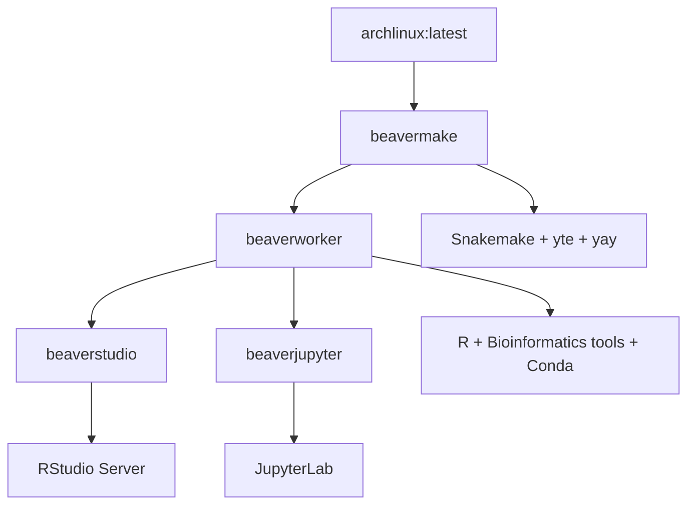

# 🦫 BeaverdownContainers - Beaverdown2生物信息学容器套件

[](https://github.com/rainoffallingstar/BeaverdownContainers/actions/workflows/beavermake.yml) [](https://github.com/rainoffallingstar/BeaverdownContainers/actions/workflows/beaverworker.yml)
[](https://github.com/rainoffallingstar/BeaverdownContainers/actions/workflows/beaverstudio.yml) [](https://github.com/rainoffallingstar/BeaverdownContainers/actions/workflows/beaverjupyter.yml)

---

## 📦 项目概述

BeaverdownContainers 是 **Beaverdown2 生物信息学工作流系统**的高效 Docker 容器套件 `<small>`(Efficient Docker container suite for the Beaverdown2 bioinformatics workflow system)`</small>`。这些容器专为性能和易用性设计，简化了生物信息学和数据分析任务。

✨ **核心特色**:

- 🐧 **基于 Arch Linux** - 轻量、灵活的 Linux 发行版
- 🧰 **yay AUR 助手** - 强大的 Arch 用户仓库包管理
- 🐍 **Snakemake 工作流** - 科学计算工作流管理系统
- 📊 **R 语言环境** - 完整的统计分析生态系统
- 📓 **Python/Jupyter** - 交互式计算和数据分析
- 🧬 **生物信息学工具链** - 丰富的专业分析工具

容器采用层次化设计，从基础镜像逐步构建，确保每一层都有明确的功能分工和依赖管理。

---

## 🏗️ 容器架构

### 📊 架构图



### 🎯 层次化容器结构

1. **🛠️ beavermake** - 基础容器层 `<small>`(Base container layer)`</small>`

   - **基础镜像**: `archlinux:latest`
   - **核心工具**: Snakemake `<small>`(workflow management)`</small>`, yte `<small>`(YAML template engine)`</small>`, yay `<small>`(AUR helper)`</small>`
   - **特点**: 并行编译配置，最小权限用户 `builduser`
2. **🧬 beaverworker** - 生物信息学增强层 `<small>`(Bioinformatics enhanced layer)`</small>`

   - **继承自**: `fallingstar10/beavermake:latest`
   - **添加工具**:
     - 📊 **R 语言环境** - 完整的数据分析生态系统
     - 🧪 **生物信息学工具** - samtools, htslib, bedtools 等
     - 🐍 **Python 科学栈** - pandas, numpy, scipy
     - 📦 **Conda 环境** - 多个隔离的软件环境
   - **构建策略**: 分批安装、重试机制、镜像加速
3. **💻 beaverstudio** - RStudio 服务器 `<small>`(RStudio Server)`</small>`

   - **继承自**: `fallingstar10/beaverworker:latest`
   - **核心功能**: 基于 Web 的 R 开发环境
   - **默认用户**: `fallingstar10` (密码相同)
   - **访问端口**: 8787 (RStudio), 8080
4. **📓 beaverjupyter** - JupyterLab 服务器 `<small>`(JupyterLab Server)`</small>`

   - **继承自**: `fallingstar10/beaverworker:latest`
   - **核心功能**: 交互式计算环境
   - **访问端口**: 8889

---

## 🚀 快速开始

### 使用 Docker CLI `<small>`(Using Docker CLI)`</small>`

#### 1️⃣ 拉取预构建镜像

```bash
docker pull fallingstar10/beavermake:latest
docker pull fallingstar10/beaverworker:latest
docker pull fallingstar10/beaverstudio:latest
docker pull fallingstar10/beaverjupyter:latest
```

#### 2️⃣ 运行容器

```bash
# 🛠️ beavermake - 交互式 Shell
docker run -it --name beavermake fallingstar10/beavermake:latest

# 🧬 beaverworker - 交互式 Shell (包含所有生物信息学工具)
docker run -it --name beaverworker fallingstar10/beaverworker:latest

# 💻 beaverstudio - RStudio 服务器 (访问 http://localhost:8787)
docker run -p 8787:8787 -p 8080:8080 --name beaverstudio fallingstar10/beaverstudio:latest

# 📓 beaverjupyter - JupyterLab 服务器 (访问 http://localhost:8889)
docker run -p 8889:8889 --name beaverjupyter fallingstar10/beaverjupyter:latest
```

### 使用 R/dockerR 包 `<small>`(Using R/dockerR Package)`</small>`

如果你使用 R 语言进行数据分析，可以通过 `dockerR` 包更方便地管理容器：

#### 📥 拉取镜像

```r
# 使用项目提供的脚本
source("pull_image.R")

# 或手动执行
dockerR::image_pull("fallingstar10/beavermake:latest")
dockerR::image_pull("fallingstar10/beaverworker:latest")
dockerR::image_pull("fallingstar10/beaverstudio:latest")
dockerR::image_pull("fallingstar10/beaverjupyter:latest")
```

#### 🔨 从源码构建镜像

```r
# 使用项目提供的脚本
source("build_image.R")

# 或手动执行
dockerR::image_build(name = "fallingstar10/beavermake:latest", "beavermake")
dockerR::image_build(name = "fallingstar10/beaverworker:latest", "beaverworker")
dockerR::image_build(name = "fallingstar10/beaverstudio:latest", "beaverstudio")
dockerR::image_build(name = "fallingstar10/beaverjupyter:latest", "beaverjupyter")
```

---

## 🔧 详细构建指南

### 🖥️ 本地构建 `<small>`(Local Build)`</small>`

#### 使用 Docker CLI

```bash
# 构建所有容器镜像
docker build -t fallingstar10/beavermake:latest ./beavermake
docker build -t fallingstar10/beaverworker:latest ./beaverworker
docker build -t fallingstar10/beaverstudio:latest ./beaverstudio
docker build -t fallingstar10/beaverjupyter:latest ./beaverjupyter
```

#### 使用项目提供的 R 脚本

项目提供了多个 R 脚本来简化构建和管理过程：

- **`build_image.R`** - 一键构建所有容器镜像
- **`pull_image.R`** - 一键拉取所有预构建镜像
- **`beaverstudioUpdate.R`** - 更新 beaverstudio 容器（包含开发环境特定的卷挂载）
- **`ADD_USER.R`** - 在容器中添加用户并配置 sudo 权限的辅助脚本 `<small>`(注意：这是 Shell 脚本，不是 R 脚本)`</small>`

### ⚡ CI/CD 自动构建 `<small>`(CI/CD Auto Build)`</small>`

项目使用 **GitHub Actions** 实现持续集成和自动部署：

- **🕐 定时构建**: 每周五自动构建

  - `beavermake`: 06:00 UTC
  - `beaverworker`: 08:00 UTC
  - `beaverstudio`: 10:00 UTC
  - `beaverjupyter`: 12:00 UTC
- **🔔 触发条件**:

  - 📅 定时调度（每周）
  - 👆 手动触发 (`workflow_dispatch`)
  - 📝 对应目录的 `push` 事件
- **🚀 操作流程**: 自动构建并推送到 Docker Hub (`fallingstar10/` 命名空间)

配置文件位于 `.github/workflows/` 目录，每个容器都有独立的工作流文件。

---

## 📋 容器详细说明

### 🛠️ beavermake 容器

**基础镜像**: `archlinux:latest` `<small>`(最新版 Arch Linux)`</small>`

**🧰 核心工具**:

- **Snakemake** - 工作流管理系统 `<small>`(Workflow management system)`</small>`
- **yte** - YAML 模板引擎，Snakemake 的扩展 `<small>`(YAML template engine for Snakemake)`</small>`
- **yay** - Arch Linux AUR 助手，安装在 `builduser` 用户下 `<small>`(AUR helper for Arch Linux)`</small>`

**⚙️ 配置优化**:

- **并行编译**: 通过 `makepkg.conf` 配置文件优化编译性能
- **用户管理**: 创建最小权限用户 `builduser` 专门用于 AUR 包安装
- **包管理策略**: pacman (官方仓库) + yay (AUR 仓库)
- **镜像优化**: 清理缓存减少镜像大小，使用 pipx 安装 Python 工具

### 🧬 beaverworker 容器

**继承自**: `fallingstar10/beavermake:latest`

**🎯 主要增强功能**:

#### 1. 📊 R 语言环境 `<small>`(R Language Environment)`</small>`

- **R 基础系统**: 完整的 R 语言运行时
- **包管理器**: 使用 `pak` 进行高效的 R 包管理
- **生物信息学包**: Rsamtools, rtracklayer, GenomicRanges 等 Bioconductor 包
- **统计分析包**: tidyverse, limma, sva 等
- **机器学习包**: mlr3verse 生态系统

#### 2. 🧪 生物信息学工具链 `<small>`(Bioinformatics Toolchain)`</small>`

- **核心工具**: samtools, htslib, bedtools
- **质量控制**: fastqc, trim_galore, cutadapt
- **序列比对**: bowtie2, bwa, sambamba
- **专业工具**: qualimap, picard, Bismark, wgbs_tools 等

#### 3. 🐍 Python 科学计算栈 `<small>`(Python Scientific Stack)`</small>`

- **基础库**: pandas, numpy, scipy
- **Conda 环境管理**: 多个隔离的软件环境
  - `multiqc`: 质控报告聚合
  - `star`: RNA-seq 比对
  - `htseq`: 基因计数
  - `rmats`: 可变剪切分析

#### 4. 📦 Conda 环境管理 `<small>`(Conda Environment Management)`</small>`

- **独立环境**: py27, pyfastx, clubcpg, multiqc, star 等
- **加速工具**: 使用 mamba 替代 conda 加速包安装
- **镜像配置**: 使用清华镜像加速下载

**🔨 构建策略**:

- **分批安装**: AUR 包分组安装，降低失败风险
- **重试机制**: 网络问题自动重试 (3次尝试)
- **源码编译**: 部分工具从源码编译安装 (mHapTools, wgbs_tools 等)
- **镜像加速**: CRAN 和 Conda 使用国内镜像加速

### 💻 beaverstudio 容器

**继承自**: `fallingstar10/beaverworker:latest`

**🖥️ 核心功能**: RStudio Server - 基于 Web 的 R 集成开发环境

**👤 用户配置**:

- **默认用户**: `fallingstar10` (密码: `fallingstar10`)
- **系统用户**: `rstudio-server` (服务运行用户)
- **权限管理**: 默认用户具有 sudo 权限

**🔌 网络配置**:

- **主端口**: 8787 - RStudio Web 界面
- **附加端口**: 8080 - 可选服务端口

**⚙️ 系统配置**:

- **配置文件**: `/etc/rstudio/rserver.conf`
- **日志配置**: `/etc/rstudio/logging.conf`
- **启动脚本**: `/usr/local/bin/start-rstudio.sh`

**🚦 启动流程**:

1. 初始化必要的目录结构和权限
2. 清理旧的数据库文件确保稳定启动
3. 启动 RStudio Server 守护进程

### 📓 beaverjupyter 容器

**继承自**: `fallingstar10/beaverworker:latest`

**📔 核心功能**: JupyterLab - 交互式计算笔记本环境

**🌐 访问配置**:

- **访问端口**: 8889
- **启动命令**: `jupyter-lab --no-browser --allow-root --ip=* --port 8889`
- **语言环境**: `LANG=C.UTF-8`

**✨ 环境优势**:

- **完整工具链**: 继承 beaverworker 的所有生物信息学工具
- **多语言支持**: Python、R、Julia 等内核
- **Conda 集成**: 支持 Conda 环境作为独立内核
- **扩展生态**: 可安装丰富的 JupyterLab 扩展

---

## 🧪 使用示例

### 🧬 典型生物信息学工作流

#### 1. 📊 数据质量控制 `<small>`(Data Quality Control)`</small>`

```bash
# 使用 beaverworker 中的工具
fastqc input.fastq -o qc_results/
trim_galore --paired input_1.fastq input_2.fastq

# 在 RStudio 中可视化质控报告
# 使用 MultiQC 聚合报告
```

#### 2. 🧬 序列比对分析 `<small>`(Sequence Alignment)`</small>`

```bash
# 使用 bowtie2 进行比对
bowtie2 -x reference_index -1 input_1.fastq -2 input_2.fastq -S aligned.sam

# 使用 samtools 处理 BAM 文件
samtools view -bS aligned.sam | samtools sort -o sorted.bam
samtools index sorted.bam
```

#### 3. 🧪 甲基化分析 (WGBS) `<small>`(Methylation Analysis for WGBS)`</small>`

```bash
# 使用 Bismark 进行比对和甲基化提取
bismark_genome_preparation genome_folder/
bismark --genome genome_folder/ -1 input_1.fastq -2 input_2.fastq

# 使用 wgbs_tools 进行下游分析
python /opt/wgbs_tools/wgbs_tools.py analysis --input meth_results/

# 在 R 中使用 bsseq 包进行统计分析
```

#### 4. 🧬 RNA-seq 分析 `<small>`(RNA-seq Analysis)`</small>`

```bash
# 使用 STAR 进行比对
STAR --genomeDir star_index/ --readFilesIn input.fastq

# 使用 htseq-count 进行基因计数
htseq-count -f bam aligned.bam annotation.gtf > counts.txt

# 在 R 中使用 DESeq2/limma 进行差异表达分析
```

#### 5. 🔬 单细胞分析 `<small>`(Single-cell Analysis)`</small>`

```python
# 在 JupyterLab 中使用 Scanpy (Python)
import scanpy as sc
adata = sc.read_10x_mtx("filtered_feature_bc_matrix/")
sc.pp.normalize_total(adata)
sc.tl.pca(adata)
sc.pl.pca(adata)
```

```r
# 在 RStudio 中使用 Seurat (R)
library(Seurat)
pbmc.data <- Read10X(data.dir = "filtered_feature_bc_matrix/")
pbmc <- CreateSeuratObject(counts = pbmc.data)
pbmc <- NormalizeData(pbmc)
pbmc <- FindVariableFeatures(pbmc)
```

### 💻 开发工作流

#### 📦 R 包开发

- 在 RStudio 中开发新的 R 包
- 使用 devtools 进行测试和文档生成
- 创建 Shiny 应用程序进行交互式可视化

#### 📓 数据分析探索

- 在 JupyterLab 中进行探索性数据分析
- 使用 Python 和 R 进行数据清洗和可视化
- 创建可重复的分析报告

#### ⚙️ 工作流编排

- 使用 Snakemake 编排完整分析流程
- 利用 yte 模板引擎进行参数化配置
- 实现可重复、可扩展的分析管道

---

## ⚙️ 系统要求

### 💻 最低硬件要求

- **内存**: 至少 4GB RAM (推荐 8GB+ 用于生物信息学分析)
- **存储**: 至少 10GB 可用磁盘空间
- **CPU**: 支持虚拟化的多核处理器 (推荐 4 核以上)

### 📦 软件要求

- **Docker**: 版本 20.10 或更高
- **操作系统**: 支持 Docker 的任何系统
  - 🐧 Linux: 原生支持
  - 🪟 Windows: 推荐使用 WSL2
  - 🍎 macOS: 原生支持

### 🌐 网络要求

- **互联网连接**: 稳定的网络以下载依赖包
- **访问资源**:
  - Docker Hub (拉取镜像)
  - GitHub (源码和工具)
  - Arch Linux 官方仓库
  - CRAN (R 包仓库)
  - Conda 仓库

---

## 🔍 故障排除

### ❗ 常见问题及解决方案

#### 1. 🔌 构建失败 - 网络问题

```
问题: 构建过程中下载失败或超时
解决方案:
1. 检查网络连接稳定性
2. 使用国内镜像站点 (已在配置中启用清华镜像)
3. 增加 Docker 构建超时时间
4. 分阶段构建，减少单次下载量
```

#### 2. 📦 AUR 包安装失败

```
问题: yay 安装 AUR 包时失败
解决方案:
1. Dockerfile 中已有重试机制 (3次尝试)
2. 手动更新 PKGBUILD 文件
3. 寻找功能相似的替代包
4. 从源码编译安装
```

#### 3. 📊 R 包安装失败

```
问题: pak 安装 R 包时依赖缺失
解决方案:
1. 检查系统依赖是否完整安装
2. 验证 CRAN 镜像配置
3. 尝试手动安装缺失的系统库
4. 使用特定版本号避免兼容性问题
```

#### 4. 🚀 容器启动失败

```
问题: 容器启动后立即退出
解决方案:
1. 检查端口冲突: `netstat -tulpn | grep <端口号>`
2. 查看容器日志: `docker logs <容器名称>`
3. 验证镜像完整性: `docker images`
4. 检查用户权限和目录挂载
```

#### 5. 🔐 权限问题

```
问题: 容器内操作权限不足
解决方案:
1. 确保使用正确的用户身份
2. 在 docker run 中添加用户映射: `--user $(id -u):$(id -g)`
3. 检查挂载目录的权限设置
4. 验证 sudoers 配置
```

### 📞 获取帮助

- **GitHub Issues**: [项目 Issues 页面](https://github.com/rainoffallingstar/BeaverdownContainers/issues)
- **Docker Hub**: [fallingstar10 主页](https://hub.docker.com/u/fallingstar10)
- **社区支持**: 通过 GitHub Discussions 或相关社区论坛

---

## 🤝 贡献指南

### 🌟 欢迎贡献！

我们欢迎任何形式的贡献，包括但不限于：

#### 1. 🐛 报告问题

- 使用 GitHub Issues 报告 bug
- 提出新功能建议
- 提供详细的重现步骤和环境信息

#### 2. 💻 提交代码

- Fork 本仓库并创建功能分支
- 遵循现有的代码风格和结构
- 添加适当的测试和文档
- 提交 Pull Request

#### 3. 📚 改进文档

- 完善 README 和注释
- 添加使用示例和教程
- 翻译或校对文档内容

#### 4. 🧪 测试验证

- 测试新功能在不同环境下的表现
- 验证构建过程的正确性
- 性能测试和优化建议

### 🔧 开发规范

#### 容器设计原则

- **层次清晰**: 保持 Dockerfile 的继承关系明确
- **镜像优化**: 尽量减少镜像大小，清理构建缓存
- **向后兼容**: 确保新版本不破坏现有功能
- **明确依赖**: 准确声明软件依赖和版本

#### 代码质量标准

- **有意义的提交信息**: 清晰描述更改内容
- **代码注释**: 关键逻辑添加注释说明
- **文档更新**: 代码变更同步更新文档
- **测试覆盖**: 重要功能添加测试用例

---

## 📄 许可证

本项目基于 **MIT 许可证**开源发布。

```text
MIT License

Copyright (c) 2023 rainoffallingstar

Permission is hereby granted, free of charge, to any person obtaining a copy
of this software and associated documentation files (the "Software"), to deal
in the Software without restriction, including without limitation the rights
to use, copy, modify, merge, publish, distribute, sublicense, and/or sell
copies of the Software, and to permit persons to whom the Software is
furnished to do so, subject to the following conditions:

The above copyright notice and this permission notice shall be included in all
copies or substantial portions of the Software.

THE SOFTWARE IS PROVIDED "AS IS", WITHOUT WARRANTY OF ANY KIND, EXPRESS OR
IMPLIED, INCLUDING BUT NOT LIMITED TO THE WARRANTIES OF MERCHANTABILITY,
FITNESS FOR A PARTICULAR PURPOSE AND NONINFRINGEMENT. IN NO EVENT SHALL THE
AUTHORS OR COPYRIGHT HOLDERS BE LIABLE FOR ANY CLAIM, DAMAGES OR OTHER
LIABILITY, WHETHER IN AN ACTION OF CONTRACT, TORT OR OTHERWISE, ARISING FROM,
OUT OF OR IN CONNECTION WITH THE SOFTWARE OR THE USE OR OTHER DEALINGS IN THE
SOFTWARE.
```

---

## 🙏 致谢

### 🏆 感谢以下优秀项目和社区

#### 核心技术栈

- **🐧 Arch Linux** - 轻量、灵活的 Linux 发行版
- **🐍 Snakemake** - 科学计算工作流管理系统
- **📊 R 语言社区** - 丰富的统计分析和可视化包
- **🧬 Bioconductor** - 生物信息学 R 包生态系统
- **📦 Conda/Mamba** - Python 包和环境管理
- **🐋 Docker** - 容器化技术标准

#### 开发工具和平台

- **⚡ GitHub Actions** - 持续集成和部署
- **🐙 GitHub** - 代码托管和协作平台
- **📚 文档工具** - Markdown, Mermaid 等

#### 特别感谢

- **👥 所有贡献者** - 感谢每一位代码贡献者
- **💡 用户反馈** - 提供宝贵建议的用户
- **🔧 依赖项目维护者** - 众多优秀开源项目的维护团队

### 🌈 开源精神

本项目秉承开源精神，致力于为生物信息学社区提供高质量、可重复的计算环境。我们相信开放协作能够推动科学进步，欢迎更多人加入我们的行列！

---

<div align="center">

**✨ 让生物信息学分析更简单、更可重复！**

[⭐ Star 本项目](https://github.com/rainoffallingstar/BeaverdownContainers) | [📝 报告问题](https://github.com/rainoffallingstar/BeaverdownContainers/issues) | [🔧 参与贡献](#-贡献指南)

</div>
